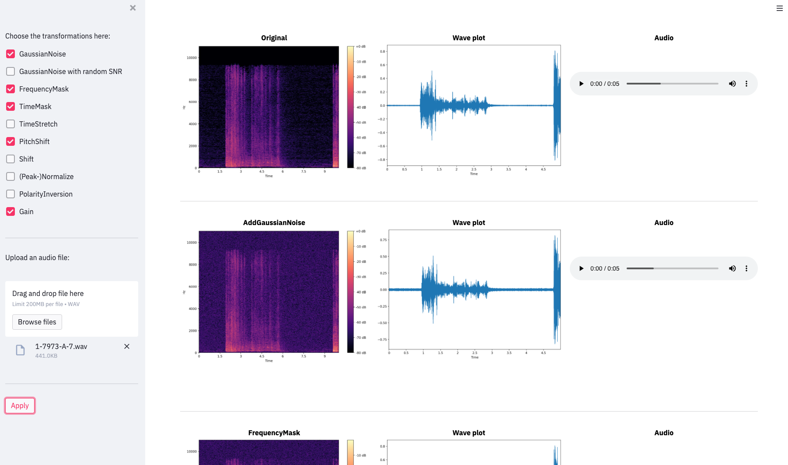

# Visualize audio transformations with streamlit
A streamlit application that lets you explore the effect of different audio augmentation techniques. Uses [audiomentations](https://github.com/iver56/audiomentations) to implement the augmentations. Try it live [here](https://share.streamlit.io/phrasenmaeher/audio-transformation-visualization/main/visualize_transformation.py)!

You build your pipeline by selecting augmentations in the left sidebar. Then, you upload or select a provided file (taken from the [ESC-50 dataset](https://github.com/karolpiczak/ESC-50)). To start, click "Apply"; the indvidual steps of the pipeline are visualized.

